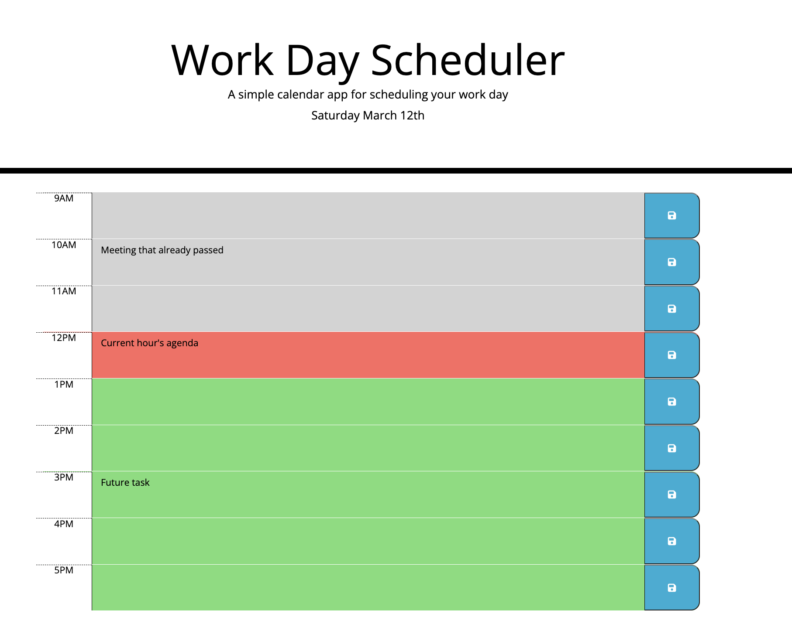

# Work Day Scheduler Starter Code

Work Day Scheduler is a simple calendar app for scheduling your work day.

## About

In this challenge, the goal was to create a calendar application that a user can use to track their day. It should display the current date and the user's tasks upon loading and persist even after the browser window is closed.
 
I applied what we learned about local storage, jQuery, Moment.js, and Bootstrap.

## Deployed Application

[https://mannygarcia98.github.io/challenge-5-day-scheduler/](https://mannygarcia98.github.io/challenge-5-day-scheduler/)
